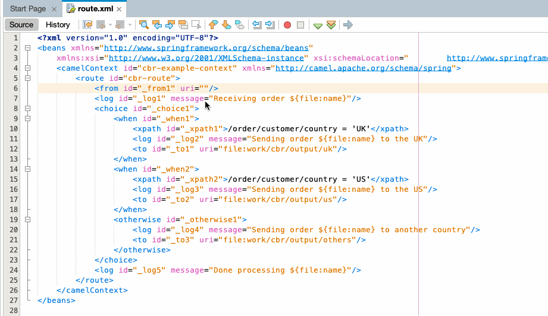
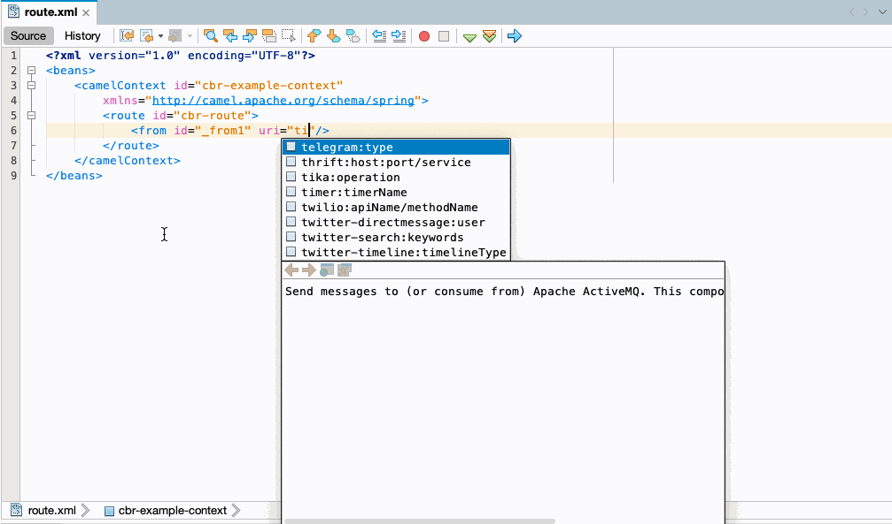
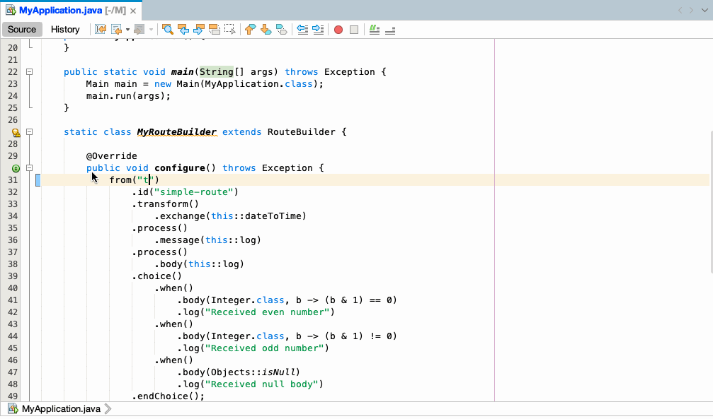
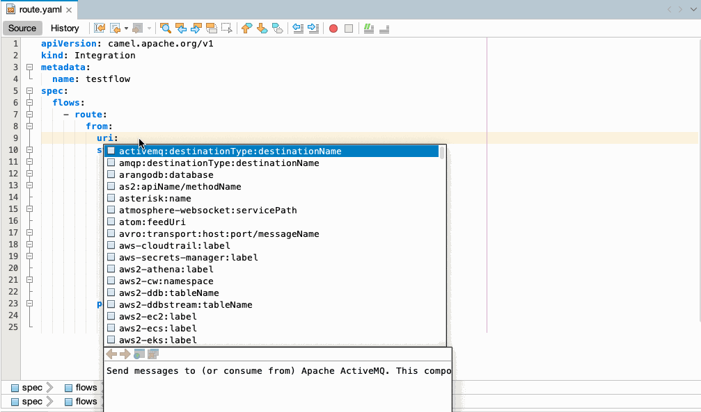
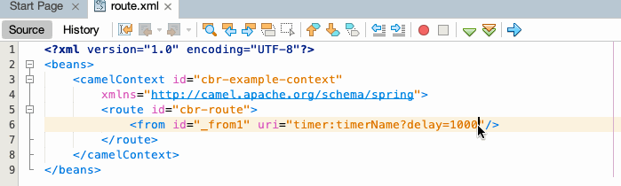
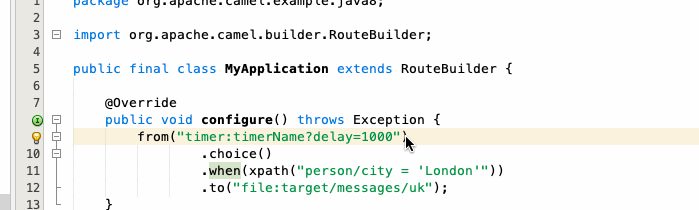
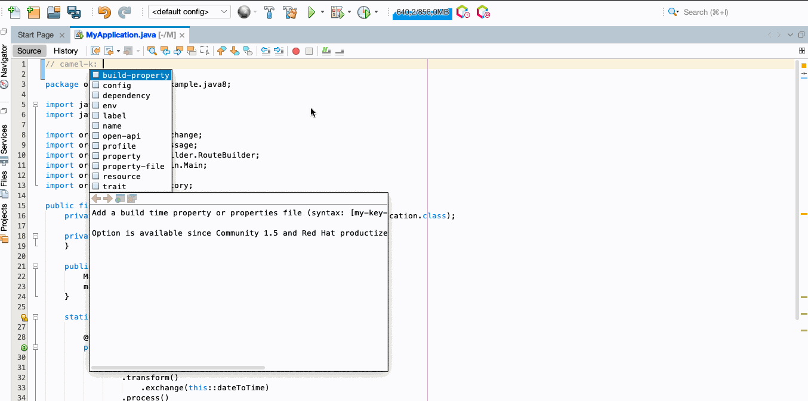
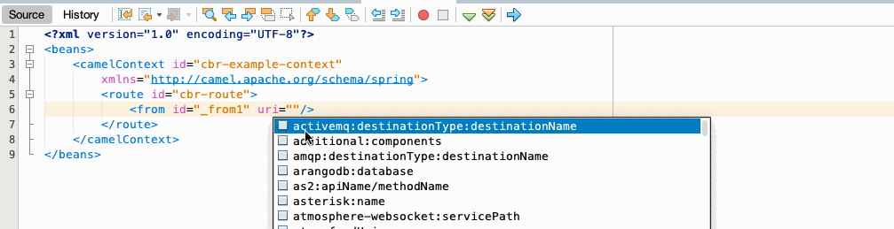

<h1 align="center">
  
  <br>Language Support for Apache Camel</br>
</h1>

<p align="center">
  <a href="./CHANGELOG.md"></a>
  <a href="./LICENSE"></a>
  <a href="https://plugins.netbeans.apache.org/"></a>  
</p>

<p align="center">
  <a href="#features">Features</a> •
  <a href="#requirements">Requirements</a> •
  <a href="#how-to-use">How To Use</a> •
  <a href="#issues">Issues</a>
</p>

<p align="center">
This is the <a href="https://netbeans.apache.org/">Apache NetBeans</a> extension that adds language support for <a href="http://camel.apache.org/">Apache Camel</a> for XML, Java and YAML DSL code.
</p><br/>

<p align="center"></p>

### Features
- Language service support for Apache Camel URIs.
- Diagnostics for Camel URIs for Java nad XML.
- Camel K modelines support.
- Use a specific Camel Catalog version.
- Use a specific Runtime provider for the Camel catalog.
- Additional Camel components can be provided.

### Requirements

**Apache NetBeans 22** is minimal required version of [Apache NetBeans IDE](https://netbeans.apache.org/).

**Java 17+** is currently required to launch the [Apache Camel Language Server](https://github.com/camel-tooling/camel-language-server).

### How to use
#### Language service support for Apache Camel URIs
This feature is supported in XML DSL, Java DSL and YAML DSL. Auto-completion for Camel components, attributes, and the list of attribute values

**XML DSL**
<p></p>

**Java DSL**
<p></p>

**YAML DSL**
<p></p>


#### Diagnostics for Camel URIs for Java and XML
When invalid value is entered, diagnostic shows error. Not available for YAML DSLs.
<p></p>
<p></p>

#### Camel K modelines support
- completion for:
    - option names
    - trait definition names
    - trait property names
    - Camel artifact id for dependency
    - mvn dependency
    - Camel properties
<p></p>

#### Use a specific Camel Catalog version
It is possible to use a specific Camel Catalog version. This can be specified in `NetBeans > Settings > Apache Camel > Catalog version`.

Please note that the first time a version is used, it can take several seconds/minutes to have it available depending on the time to download the dependencies in the background.

#### Use a specific Runtime provider for the Camel catalog
It is possible to use a specific Camel Catalog version. This can be specified in `NetBeans > Settings > Apache Camel > Runtime provider`.

#### Additional Camel components can be provided
Additional Camel components can be provided. This can be specified in `NetBeans > Settings > Apache Camel > Additional components`.
<p></p>

You can add a list of Camel components definition. This json definition can be found in jar of the Camel component. You will end up with something like:
```json
[{
      "component": {
        ...
      },
      "componentProperties": {
        ...
      },
      "properties": {
        ...
      }
   }]
```
**Note**: While new file is opened, all custom settings may take few seconds to apply or even require reopening content assistant.

### Issues
Something is not working properly? In that case, feel free to [open issues, add feature requests, report bugs, etc.](https://github.com/camel-tooling/camel-lsp-client-netbeans/issues)
